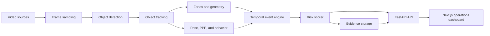
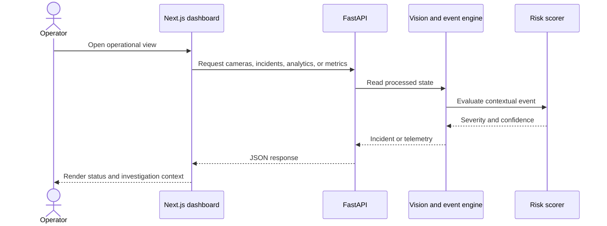

<div align="center">

# Argus

### Industrial safety intelligence for cameras, events, and operational risk

Argus is a dark, operations-console-style platform for turning video analytics into explainable safety incidents, risk signals, and evidence-ready workflows.


[Dashboard](http://localhost:3000) | [API](http://localhost:8000) | [OpenAPI docs](http://localhost:8000/docs)

</div>

> **Project status:** Argus is an actively developed prototype. The API and dashboard currently include deterministic demo data and modular interfaces for connecting real camera, model, database, and evidence-storage implementations.

## Contents

- [What Argus does](#what-argus-does)
- [Core capabilities](#core-capabilities)
- [How it works](#how-it-works)
- [Architecture](#architecture)
- [Technology](#technology)
- [API](#api)
- [Quick start](#quick-start)
- [Configuration](#configuration)
- [Testing](#testing)
- [Project structure](#project-structure)
- [Limitations and next steps](#limitations-and-next-steps)

## What Argus does

Safety teams need more than a single-frame detection. Argus is organized around the path from perception to an operationally useful incident:

1. A video source is sampled and objects are detected.
2. Tracks preserve object identity and movement over time.
3. Zone, distance, line-crossing, pose, and behavior signals add context.
4. A temporal event engine confirms candidate events and throttles repeats.
5. An explainable risk policy assigns severity.
6. Evidence and incident APIs expose the result to an operations dashboard.

This separation keeps detection, tracking, event understanding, risk scoring, and presentation independently replaceable.

## Core capabilities

<table>
<tr>
<td width="50%" valign="top">

### Perception pipeline

YOLO-compatible object detection, tracking, geometry helpers, optional pose estimation, PPE analysis, and behavior features are separated into focused modules.

</td>
<td width="50%" valign="top">

### Context-aware events

Zone breaches, proximity warnings, and other candidate events can be evaluated with spatial and temporal context instead of treating every frame as an alert.

</td>
</tr>
<tr>
<td width="50%" valign="top">

### Explainable risk

Risk scoring is designed around configurable signals including distance, zone context, velocity, object type, and duration.

</td>
<td width="50%" valign="top">

### Operations dashboard

The Next.js interface provides routes for overview, live monitoring, cameras, incidents, zones, models, analytics, and system health.

</td>
</tr>
</table>

## How it works



The event engine is intentionally temporal: candidate signals pass through a state machine before becoming operational alerts. This reduces noisy repeated notifications and preserves a path for confidence-aware confirmation.

## Architecture

Argus uses a layered backend with a thin API boundary:

- **Streaming and ingestion** manage camera input and processing queues.
- **Vision** contains detection, tracking, pose, PPE, behavior, and geometry components.
- **Events** evaluates temporal state transitions.
- **Risk** converts contextual signals into an explainable severity score.
- **Evidence** provides the boundary for snapshots and clips.
- **API** exposes cameras, incidents, zones, analytics, model, stream, and system views.
- **Frontend** renders the operational console as a separate Next.js application.



## Technology

| Layer | Verified technologies |
| --- | --- |
| Backend | Python 3.11+, FastAPI, Uvicorn, Pydantic 2, NumPy |
| Vision | YOLO-compatible detector boundary, tracking, geometry, pose, PPE, behavior modules |
| Frontend | Next.js 14, React 18, TypeScript 5.5 |
| UI | Tailwind CSS, Framer Motion, Lucide React, Recharts |
| Development | Pytest, Docker Compose, PostgreSQL 16, Redis 7 |

## API

The backend serves the root and health endpoints below, plus versioned resources under `/api/v1`.

### Service endpoints

| Method | Endpoint | Description |
| --- | --- | --- |
| `GET` | `/` | API identity and version |
| `GET` | `/health` | Service health |
| `GET` | `/health/live` | Liveness status |
| `GET` | `/health/ready` | Readiness status |

### Versioned endpoints

| Method | Endpoint | Description |
| --- | --- | --- |
| `GET` | `/api/v1/cameras/` | List cameras |
| `GET` | `/api/v1/cameras/{camera_id}` | Read one camera |
| `GET` | `/api/v1/incidents/` | List incidents |
| `GET` | `/api/v1/incidents/{incident_id}` | Read one incident |
| `GET` | `/api/v1/zones/` | List zones |
| `POST` | `/api/v1/zones/` | Add a zone from a JSON body |
| `GET` | `/api/v1/analytics/` | Summary and event trend data |
| `GET` | `/api/v1/models/` | Available model status |
| `GET` | `/api/v1/streams/health` | Stream telemetry |
| `GET` | `/api/v1/system/health` | Runtime health |
| `GET` | `/api/v1/system/metrics` | Runtime and pipeline metrics |

Interactive OpenAPI documentation is available at `http://localhost:8000/docs` when the backend is running.

## Quick start

### Local development

Requirements:

- Python 3.11 or newer
- Node.js and npm
- PostgreSQL and Redis only if your local configuration needs them

In PowerShell:

```powershell
git clone https://github.com/Yog-esh06/Argus.git
Set-Location Argus

Copy-Item .env.example .env
py -3.11 -m venv .venv
.\.venv\Scripts\Activate.ps1
python -m pip install -e .

Set-Location frontend
npm install
Set-Location ..
```

Start the backend in one terminal:

```powershell
Set-Location backend
python -m uvicorn app.main:app --reload --host 0.0.0.0 --port 8000
```

Start the dashboard in another:

```powershell
Set-Location frontend
npm run dev
```

The dashboard is served at `http://localhost:3000`, and the API is served at `http://localhost:8000`.

You can also start both local processes from the repository root:

```powershell
python run.py
```

### Docker Compose

To build the backend and frontend images and start the declared supporting services:

```powershell
Copy-Item .env.example .env
docker compose up --build
```

Compose declares:

- `backend` on port `8000`
- `frontend` on port `3000`
- PostgreSQL 16 on port `5432`
- Redis 7 on port `6379`

## Configuration

`.env.example` documents the current runtime configuration surface. Do not commit real credentials or model artifacts.

| Variable | Default | Purpose |
| --- | --- | --- |
| `APP_NAME` | `Argus` | Application name |
| `APP_ENV` | `development` | Runtime environment label |
| `APP_DEBUG` | `true` | FastAPI debug mode |
| `APP_PORT` | `8000` | Application port |
| `DATABASE_URL` | local PostgreSQL URL | Database connection setting |
| `REDIS_URL` | `redis://localhost:6379/0` | Redis connection setting |
| `MODEL_NAME` | `yolov8n.pt` | Detection model name |
| `CONFIDENCE_THRESHOLD` | `0.45` | Detection confidence threshold |
| `MAX_TRACK_AGE` | `30` | Maximum track age |
| `POSE_ENABLED` | `false` | Enable pose processing |
| `DEMO_MODE` | `true` | Enable demo behavior |

The current `Settings` object provides safe development defaults. Database and Redis services are declared by Compose for the platform's integration boundary; wire them into application services before treating a deployment as production-ready.

## Testing

Run the backend test suite from the repository root:

```powershell
pytest
```

The suite includes API coverage and unit tests for geometry and risk scoring. The frontend also exposes the standard Next.js commands:

```powershell
Set-Location frontend
npm run build
npm run start
```

## Project structure

```text
Argus/
├── backend/
│   ├── app/
│   │   ├── api/v1/          # Versioned FastAPI routers
│   │   ├── events/          # Temporal event engine and state machine
│   │   ├── evidence/        # Evidence storage boundary
│   │   ├── risk/            # Explainable risk scoring
│   │   ├── streaming/       # Stream management
│   │   └── vision/          # Detection, tracking, geometry, pose, PPE, behavior
│   └── tests/               # API and domain unit tests
├── deployment/              # Backend and frontend Dockerfiles
├── docs/                    # Architecture and subsystem notes
├── frontend/
│   ├── app/                 # Next.js dashboard routes
│   ├── components/          # Shared UI components
│   └── lib/                 # Frontend helpers
├── docker-compose.yml
├── Makefile
├── pyproject.toml
└── run.py                   # Local backend + frontend launcher
```

## Limitations and next steps

The repository makes the architecture explicit, but several production concerns remain open:

- Camera ingestion and inference are represented by modular boundaries and demo-oriented implementations.
- Several API responses currently use in-memory or deterministic sample data.
- Authentication, authorization, durable incident persistence, and production evidence retention are not implemented.
- The configured PostgreSQL and Redis services are available in Compose but are not yet the complete persistence/queue path.
- Real-time workloads may require GPU-capable infrastructure, resolution/frame-skipping controls, and operational observability.
- The frontend and backend should be connected to live API state as integrations mature.

Natural next steps are to connect camera adapters, persist incidents and zones, add authenticated operator workflows, complete evidence capture, and validate model and latency behavior on representative footage.

## Contributing

Keep changes focused by subsystem, add or update tests for behavior changes, and document new configuration or API routes. For larger changes, describe the data flow and operational impact in the relevant file under `docs/`.

## License

No license file is currently included in the repository. Add a license before distributing Argus as an open-source package.

<div align="center">

**Argus — from visual signals to operational clarity.**

</div>
