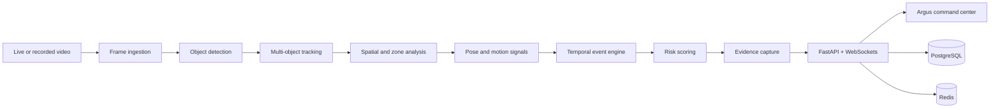

# 👁️ Argus

## Industrial Safety, Vision & Operational Intelligence

> **See risk sooner. Understand every event. Operate with confidence.**

Argus is a production-oriented computer-vision platform for real-time industrial
safety monitoring. It turns live or recorded video into operational awareness:
objects are detected, identities persist across frames, zones and proximity are
understood, unsafe situations are confirmed over time, and incidents are
captured with evidence for investigation.

Built for warehouses, factories, construction sites, logistics operations, and
other environments where visibility is a safety requirement, Argus combines a
FastAPI intelligence layer with a Next.js command-center interface.

---

## ✨ Why Argus?

Most camera systems show you what happened. Argus is designed to help explain
**what is happening, why it matters, and what to do next**.

| Capability | What it delivers |
| --- | --- |
| **Live operational view** | A focused dashboard for cameras, events, system health, and active response |
| **Detection and tracking** | Persistent track IDs and trajectories instead of isolated frame-by-frame detections |
| **Spatial intelligence** | Zones, virtual lines, proximity checks, and calibrated distance reasoning |
| **Temporal confirmation** | State-machine logic that reduces noisy one-frame alerts |
| **Risk scoring** | Severity-aware policies for prioritizing the events that need attention |
| **Evidence-backed incidents** | Structured records ready for review, audit, and follow-up |
| **Demo-first development** | Synthetic and local workflows that make the platform easy to explore |

## 🧭 Platform at a glance



## 🚀 Quick start

### Prerequisites

- Python **3.11+**
- Node.js **20+**
- npm
- Git
- Docker Desktop (optional, for the containerized stack)

### 1. Install dependencies

From the repository root:

```bash
python -m pip install -e .
cd frontend
npm install
cd ..
```

### 2. Start Argus with one command

```bash
python run.py
```

The launcher starts both development services and shuts them down together with
one `Ctrl+C`:

- **Command center:** http://localhost:3000
- **API:** http://localhost:8000
- **Interactive API docs:** http://localhost:8000/docs
- **Health check:** http://localhost:8000/health

### 3. Configure the environment (optional)

Copy the example configuration and adjust values for your environment:

```bash
copy .env.example .env
```

On macOS or Linux, use `cp .env.example .env` instead. The local demo works
with the built-in defaults; `.env` becomes especially useful when connecting
Argus to PostgreSQL, Redis, model weights, or a deployment-specific camera
configuration.

## 🐳 Run the full container stack

Docker Compose starts the backend, frontend, PostgreSQL, and Redis services:

```bash
docker compose up --build
```

Open http://localhost:3000 after the services become healthy. To stop and
remove the containers:

```bash
docker compose down
```

To remove the local database volume as well, use `docker compose down -v`.

## 🗺️ Product surfaces

The Next.js command center includes dedicated views for:

- **Overview** — operational snapshot and event stream
- **Live** — active monitoring workflows
- **Cameras** — camera inventory and status
- **Incidents** — evidence-backed safety events
- **Zones** — spatial boundaries and restricted areas
- **Analytics** — historical operational trends
- **Models** — detection configuration and model status
- **System** — health and infrastructure signals

The FastAPI service exposes versioned routes under `/api/v1/`:

| Route | Purpose |
| --- | --- |
| `/api/v1/cameras/` | Camera inventory and camera operations |
| `/api/v1/incidents/` | Incident records and evidence workflows |
| `/api/v1/zones/` | Zone and virtual-boundary management |
| `/api/v1/analytics/` | Historical metrics and operational analysis |
| `/api/v1/models/` | Model configuration summaries |
| `/api/v1/system/health` | System-level health information |

## 🧠 Core workflow

1. **Ingest** frames from a live or recorded source.
2. **Detect** people, vehicles, equipment, and other configured classes.
3. **Track** objects over time to preserve identity and trajectory.
4. **Interpret** zones, lines, proximity, pose, and motion.
5. **Confirm** events with temporal thresholds and cooldown logic.
6. **Score** risk using severity and policy thresholds.
7. **Capture** evidence and create a structured incident.
8. **Surface** the result in the Argus command center and API.

## 🧱 Technology stack

### Backend

- Python 3.11+
- FastAPI and Uvicorn
- Pydantic configuration and validation
- NumPy-based analytics foundations
- OpenCV-ready ingestion architecture
- Optional Ultralytics integration
- Pytest and pytest-asyncio

### Frontend

- Next.js 14
- React 18
- TypeScript
- Tailwind CSS
- Framer Motion
- Recharts
- Lucide icons

### Infrastructure

- Docker Compose
- PostgreSQL 16
- Redis 7
- Environment-driven configuration

## 📁 Repository layout

```text
Argus/
├── backend/
│   ├── app/
│   │   ├── api/             # Versioned HTTP API routes
│   │   ├── core/            # Settings, logging, and domain errors
│   │   ├── models/          # Domain and response models
│   │   ├── services/        # Detection, tracking, risk, and evidence logic
│   │   └── main.py          # FastAPI application entry point
│   └── tests/               # Backend test suite
├── frontend/
│   ├── app/                 # Next.js App Router pages
│   ├── components/          # Reusable dashboard UI
│   └── package.json         # Frontend scripts and dependencies
├── data/                    # Local/demo data
├── evidence/                # Generated incident evidence
├── deployment/              # Container build definitions
├── docs/                    # Architecture and engineering notes
├── docker-compose.yml       # Full local infrastructure stack
├── pyproject.toml           # Python package and test configuration
├── run.py                   # One-command local launcher
└── .env.example             # Configuration template
```

## 🧪 Development commands

```bash
# Run the backend test suite
pytest

# Run the frontend development server only
cd frontend
npm run dev

# Build the frontend
npm run build

# Start a production frontend build
npm run start
```

The Makefile also provides shortcuts:

```bash
make install
make test
make run
```

On Windows, `python run.py` and Docker Compose are the recommended commands.

## 🔌 Health and API discovery

Argus provides lightweight probes for local development and orchestration:

- `GET /health` — service health
- `GET /health/live` — liveness
- `GET /health/ready` — readiness
- `GET /docs` — Swagger UI
- `GET /redoc` — ReDoc

Example:

```bash
curl http://localhost:8000/health
```

## 🎬 Demo workflow

1. Start Argus with `python run.py`.
2. Open the command center at http://localhost:3000.
3. Load or configure a demo camera.
4. Define zones, lines, and thresholds.
5. Start monitoring and observe track IDs.
6. Review confirmed incidents and captured evidence.
7. Explore analytics and system metrics.

## 🔐 Configuration

The main settings available in `.env` include:

| Variable | Default | Meaning |
| --- | --- | --- |
| `APP_NAME` | `Argus` | Display name for the API |
| `APP_ENV` | `development` | Runtime environment |
| `APP_DEBUG` | `true` | Development diagnostics |
| `APP_PORT` | `8000` | Backend port |
| `DATABASE_URL` | local Argus PostgreSQL URL | Database connection |
| `REDIS_URL` | local Redis URL | Cache and event infrastructure |
| `MODEL_NAME` | `yolov8n.pt` | Detection model identifier |
| `CONFIDENCE_THRESHOLD` | `0.45` | Minimum detection confidence |
| `MAX_TRACK_AGE` | `30` | Maximum missed frames for a track |
| `POSE_ENABLED` | `false` | Enable pose-related signals |
| `DEMO_MODE` | `true` | Enable local demonstration behavior |

## 🛡️ Scope and limitations

Argus is a strong foundation for a safety-operations product, but responsible
deployment still requires site-specific validation. Production environments
need calibrated camera geometry, representative model evaluation, secure
networking, retention policies, access controls, observability, and a human
review process for high-impact decisions.

The current implementation is not a replacement for a full GPU-accelerated
surveillance deployment. RTSP ingestion, advanced model serving, durable
PostgreSQL persistence, worker-based ingestion, and enterprise-grade identity
controls remain natural expansion areas.

## 🛣️ Roadmap

- [ ] Real RTSP ingestion and frame streaming
- [ ] Ultralytics YOLO model integration and benchmarking
- [ ] Durable PostgreSQL repositories and migrations
- [ ] Worker-based event ingestion and queue processing
- [ ] Advanced pose estimation and fall detection
- [ ] Multi-camera event correlation
- [ ] Evidence clip generation and retention management
- [ ] Role-based access control and audit trails
- [ ] Active learning and historical behavior modeling

## 🤝 Contributing

1. Create a focused branch.
2. Keep changes scoped and documented.
3. Add or update tests for behavior changes.
4. Run `pytest` and the relevant frontend checks.
5. Open a pull request describing the operational impact.

## 📄 License

No license has been declared yet. Add a `LICENSE` file before distributing
Argus outside the project or incorporating it into a commercial deployment.

---

<p align="center">
  <strong>Argus — operational vision for safer environments.</strong><br />
  Detect clearly · reason carefully · respond quickly
</p>
